# Grupo 3 - Evolución del Proyecto SPA (TP3)

[](https://reactjs.org/)
[](https://vitejs.dev/)
[](https://reactrouter.com/)
[](https://tree-groupg-font-end-tp3.vercel.app/)

## 📖 Descripción del Proyecto

Este repositorio corresponde al **Trabajo Práctico N°3** y continúa la evolución del proyecto iniciado en el **TP1** y migrado a SPA en el **TP2**.

En el **TP3** trabajamos sobre la SPA de antihéroes para:

- Implementar **5 mejoras obligatorias** propuestas en la consigna.
- Añadir una **mejora propia**: un sistema completo de **tema Oscuro/Claro** aplicado a toda la interfaz mediante Context API.
- Mantener la arquitectura de componentes, la navegación SPA y la organización por funcionalidades que construimos en el TP2.

La aplicación sigue siendo una **SPA en React** que muestra:

- Galería de antihéroes desde **JSON local**.
- Listado de series desde **API externa (TVMaze)**.
- Perfiles personalizados por integrante del grupo.
- Bitácora del proceso y diagramas de arquitectura.

---

## 🚀 Demo en Vivo

➡️ **[Ver Aplicación Desplegada en Vercel](https://tree-groupg-font-end-tp3.vercel.app/)**

---

## 🔄 Evolución Tecnológica: TP2 → TP3

En el TP2 ya habíamos realizado la migración de **MPA estática** a **SPA en React**.  
El foco del TP3 fue **refinar la SPA existente**, mejorando la UX/UI y la experiencia visual.

| Aspecto        | TP2                             | TP3                                                    |
| :------------- | :------------------------------ | :----------------------------------------------------- |
| Interfaz       | Componentes con estilos básicos | 🎞️ Animaciones suaves en tarjetas y controles          |
| Galería        | Grid estático de cartas         | 🖼️ Lightbox interactivo para imágenes                  |
| Perfiles       | Secciones informativas          | 📊 Barras de progreso animadas para skills             |
| Redes Sociales | Enlaces simples o inexistentes  | 🔗 Botones de redes sociales animados y reutilizables  |
| Proyectos      | Listado estático                | 🎠 Carrusel de proyectos responsivo                    |
| Tema visual    | Un solo tema                    | 🌗 Tema global Oscuro/Claro con Context y localStorage |

---

## 📋 Mejoras Implementadas (Consigna TP3)

A continuación se documentan las **cinco mejoras obligatorias** (según el enunciado del TP3) y **una mejora propia adicional**.  
Cada mejora incluye descripción, archivos involucrados y capturas de antes/después (según exige la consigna).

> 💡 Las rutas de las imágenes son de ejemplo. Una vez generadas las capturas, se pueden guardar por ejemplo en `public/tp3/` y ajustar la ruta.

---

### 1️⃣ Animaciones Suaves en la Interfaz

**Descripción:**  
Se añadieron transiciones y animaciones suaves en distintas partes de la UI para hacer la experiencia más fluida y moderna.

**Características:**

- Transiciones en **tarjetas de antihéroes** al hacer hover.
- Efectos de escala y sombra en las tarjetas de equipo.
- Animaciones de entrada en secciones clave (ej. en el hero / carrusel).
- Todas las animaciones se implementan con **CSS puro** (transitions / keyframes).

**Archivos principales:**

- `src/styles/global.css`  
  ↳ Variables y clases de animación globales.
- `src/components/antiheroes/AntiHeroCard.jsx`  
  ↳ Hover y transición en la tarjeta de antihéroe.
- `src/components/home/TeamCard.jsx`  
  ↳ Hover y animaciones para el equipo.
- Otros componentes con pequeños ajustes de transición en botones y controles.

**Capturas:**

- Antes:  
  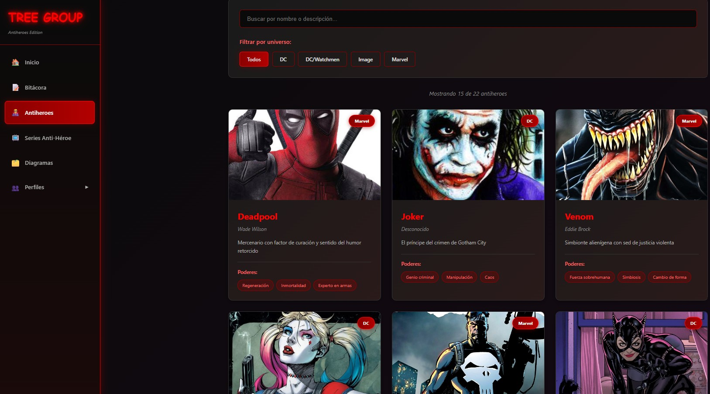
- Después:  
  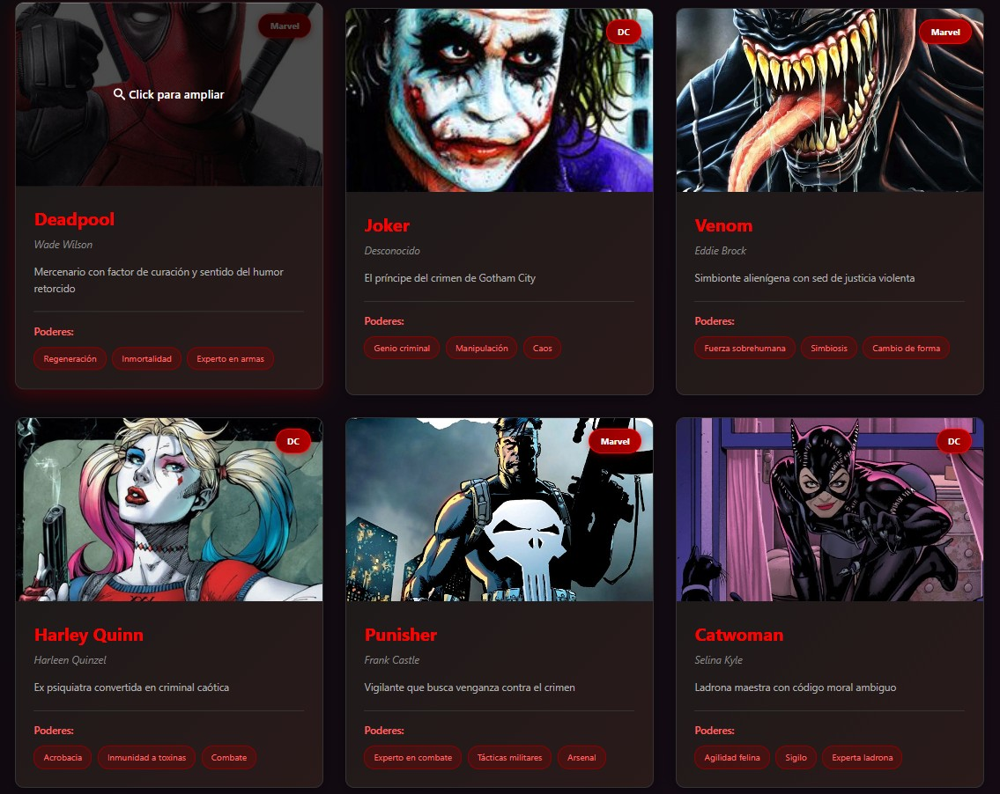

- Antes:  
  
- Después:  
  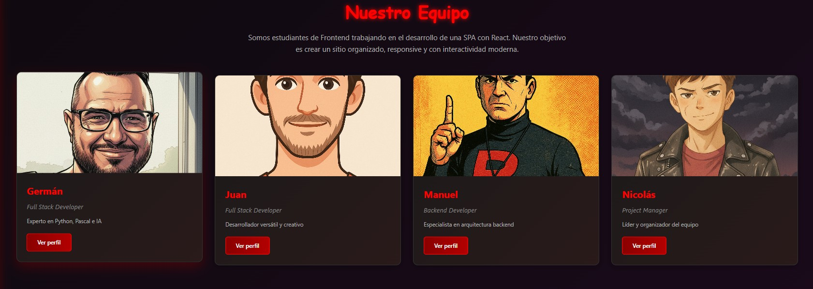

---

### 2️⃣ Galería de Imágenes Interactiva con Lightbox

**Descripción:**  
La galería de antihéroes ahora permite abrir las imágenes en un **lightbox** interactivo con navegación.

**Características:**

- Grid de tarjetas que disparan un **lightbox** al hacer click.
- Navegación entre imágenes (anterior / siguiente).
- Cierre con botón de cierre o tecla **ESC**.
- Efecto de **zoom / fade** al mostrar la imagen.
- Fondo oscurecido para enfocar la imagen.

**Archivos principales:**

- **Creado:** `src/components/shared/ImageLightbox.jsx`  
  ↳ Componente reutilizable de lightbox.
- **Modificado:** `src/components/antiheroes/AntiHeroCard.jsx`  
  ↳ Integra el lightbox con las imágenes de antihéroes.

**Capturas:**

- Antes:  
  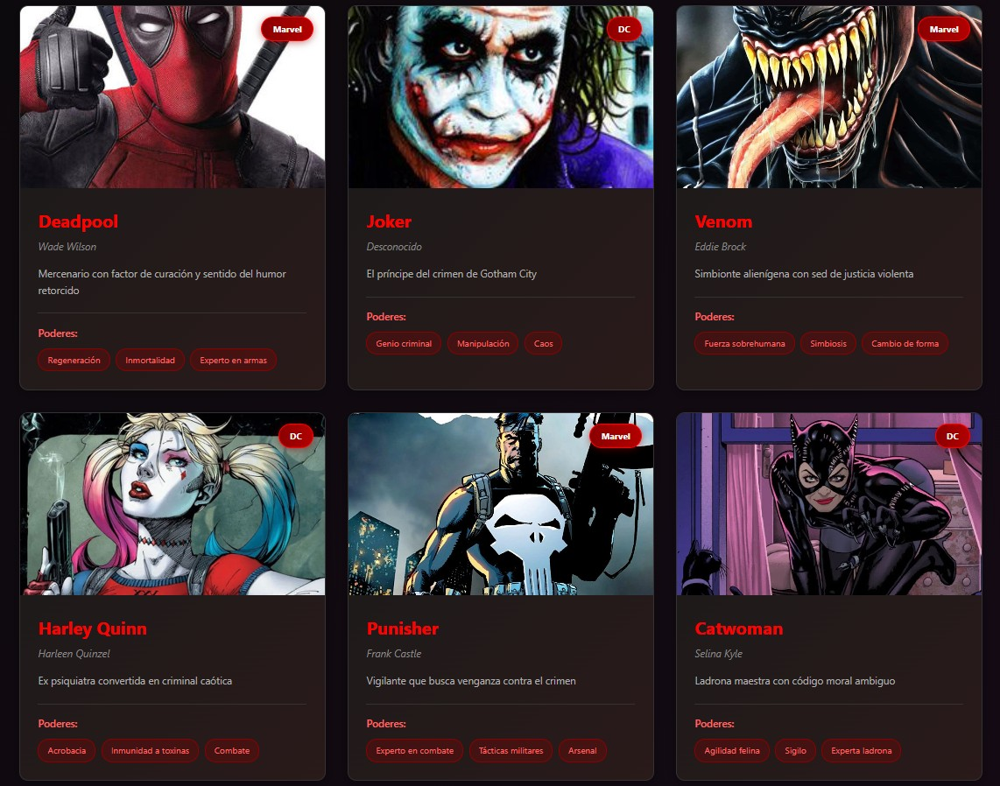
- Después:  
  

---

### 3️⃣ Barras de Progreso de Habilidades Animadas

**Descripción:**  
Se agregaron **barras de progreso** para visualizar los niveles de habilidades de forma clara y visual, con animación al cargarse.

**Características:**

- Barras que se llenan con una animación suave.
- Muestra de porcentaje de habilidad.
- Diseño responsivo y consistente con la paleta de colores del sitio.
- Integradas en los perfiles (ej. perfil de Juan).

**Archivos principales:**

- **Creado:** `src/components/shared/SkillProgressBar.jsx`  
  ↳ Componente genérico de barra de skill.
- **Utilizado en:** `src/components/profile/juan/JuanProfile.jsx` y otros perfiles.
  ↳ Ejemplo de uso para mostrar habilidades del desarrollador.

**Capturas:**

- Antes:  
  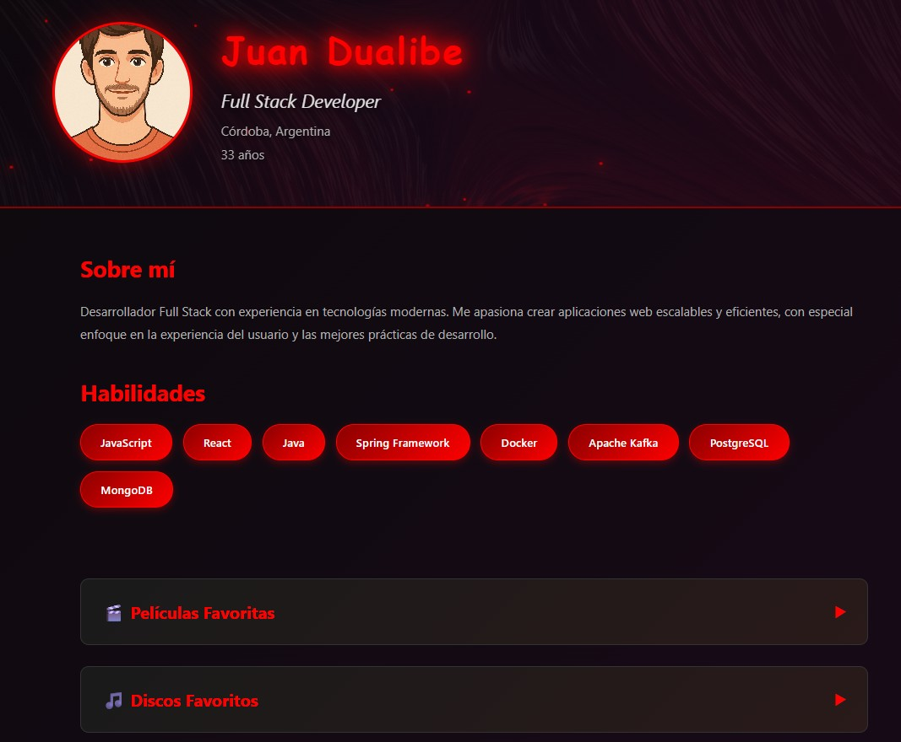
- Después:  
  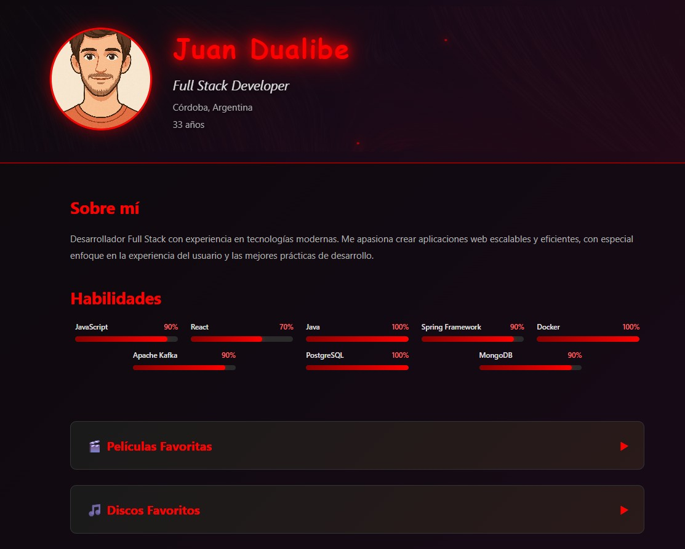

---

### 4️⃣ Botones de Redes Sociales Animados

**Descripción:**  
Se crearon **botones de redes sociales** con efectos visuales al hover, integrados en perfiles y tarjetas de equipo.

**Características:**

- Iconos para redes como LinkedIn, GitHub, etc.
- Efectos de **hover**: cambio de color, escala, sombra.
- Enlaces placeholder o ficticios (según consigna).
- Componente reutilizable, utilizado en múltiples secciones.

**Archivos principales:**

- **Creado:** `src/components/shared/SocialButton.jsx`  
  ↳ Botón reutilizable para redes.
- **Utilizado en:**
  - `src/components/profile/juan/JuanProfile.jsx` y otros perfiles.

**Capturas:**

- Antes:  
  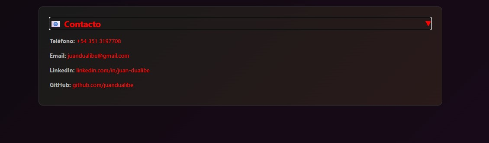
- Después:  
  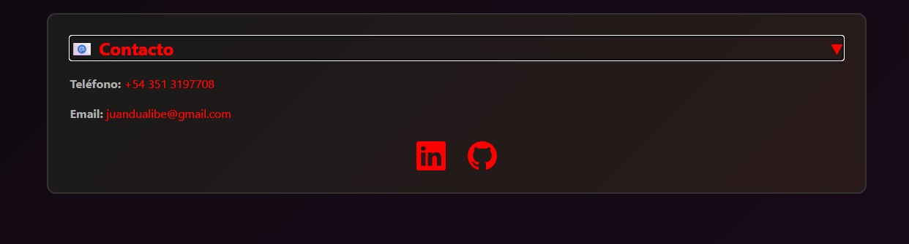

---

### 5️⃣ Carrusel de Proyectos Destacados

**Descripción:**  
Se desarrolló un **carrusel de proyectos** para mostrar trabajos ficticios o reales del equipo, con navegación manual y diseño responsive.

**Características:**

- Navegación con flechas **anterior / siguiente**.
- Indicadores **dots** para la posición actual.
- Animación tipo **slide** entre proyectos.
- Soporte para auto-play (opcional).
- Componente reutilizable que se integra fácilmente en la Home.

**Archivos principales:**

- **Creado:** `src/components/shared/ProjectCarousel.jsx`  
  ↳ Componente principal del carrusel.
- **Integrado en:** `src/containers/pages/HomePage.jsx`  
  ↳ Muestra el carrusel en la página de inicio.

**Capturas:**

- Antes:  
  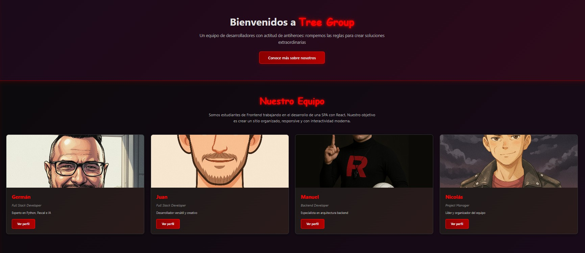
- Después:  
  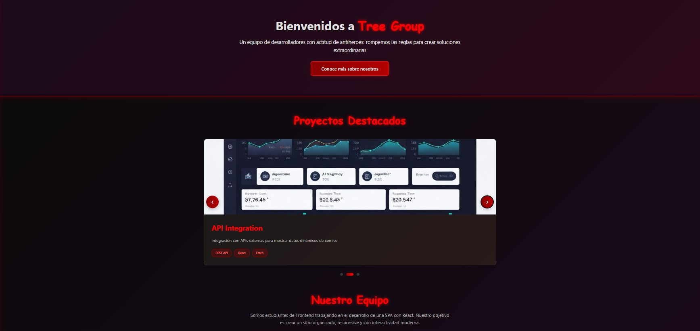

---

## ⭐ Mejora Propia Adicional: Tema Oscuro/Claro Global

Además de las 5 mejoras sugeridas en la consigna, implementamos una **mejora propia** que impacta en toda la SPA:

### 🌗 Sistema de Tema Oscuro/Claro (Nuevo en TP3)

> En el TP3 se incorpora desde cero un sistema completo de **tema global**.

**Características:**

- **Gestión global de tema** mediante `ThemeContext`.
- **Hook personalizado** `useTheme.js` para consumir el contexto.
- Persistencia en **localStorage** de la preferencia del usuario.
- Toggle en el **Sidebar** con diseño de **switch deslizable**, utilizando íconos de `react-icons`.
- Todos los estilos relevantes (fondos, bordes, colores de texto) ahora dependen de `isDark`.

**Archivos principales:**

- **Creado:**

  - `src/contexts/ThemeContext.jsx`  
    ↳ Contexto global que provee `isDark` y `toggleTheme`.
  - `src/hooks/useTheme.js`  
    ↳ Hook para acceder fácilmente al tema en cualquier componente.

- **Modificados (adaptados al tema):**
  - `src/components/navigation/Sidebar.jsx`
  - `src/components/home/HeroSection.jsx`
  - `src/components/home/TeamSection.jsx`
  - `src/components/shared/ProjectCarousel.jsx`
  - `src/components/shared/SocialButton.jsx`
  - `src/components/shared/Pagination.jsx`
  - `src/components/antiheroes/AntiHeroesControls.jsx`
  - `src/components/antiheroes/SearchBar.jsx`
  - `src/components/antiheroes/UniverseFilter.jsx`
  - `src/components/bitacora/BitacoraContent.jsx`
  - `src/components/diagrams/ComponentTreeDiagram.jsx`
  - `src/components/diagrams/FolderStructureDiagram.jsx`
  - `src/components/diagrams/DiagramsTabs.jsx`
  - `src/components/profile/nicolas/NicolasProfile.jsx`
  - `src/components/profile/nicolas/EstudiantesModal.jsx`
  - (y otros componentes menores donde se ajustaron colores y fondos)

**Capturas:**

- Sin Tema Claro/Oscuro:
  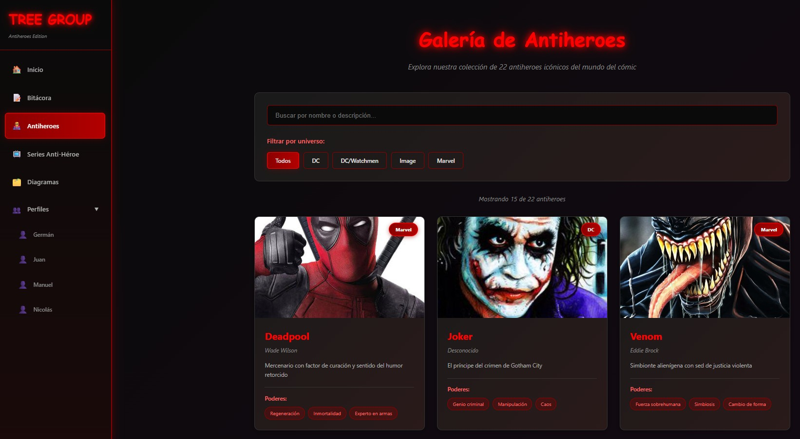

- Tema Claro:  
  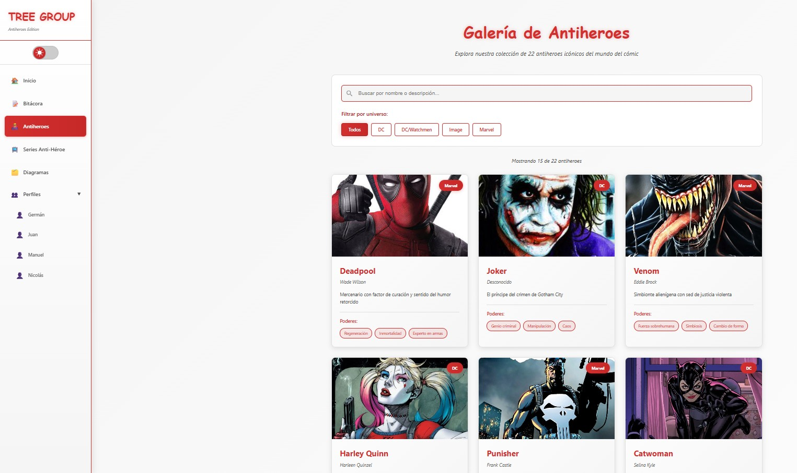
- Tema Oscuro:  
  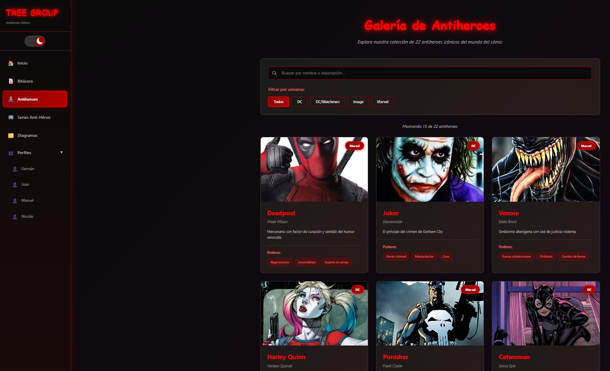

---

## 🛠️ Tecnologías Utilizadas

- **Frontend Framework:** React 19.1
- **Build Tool:** Vite 7.1 (HMR ultra-rápido)
- **Routing:** React Router DOM 7.9
- **Styling:** CSS-in-JS (estilos inline por componente) + `global.css`
- **Estado Global de Tema:** React Context API (`ThemeContext`)
- **Persistencia:** `localStorage`
- **Íconos:** `react-icons`
- **Linting:** ESLint 9
- **Deployment:** Vercel
- **Control de Versiones:** Git & GitHub
- **API Externa:** [TVMaze API](https://www.tvmaze.com/api)

---

## ⚙️ Instalación y Ejecución

### Prerrequisitos

- Node.js (v18 o superior)
- npm o yarn

### Pasos

```bash
# 1. Clonar el repositorio
git clone https://github.com/jmgasbarro/FrontEndTP3.git

# 2. Entrar al proyecto
cd FrontEndTP3

# 3. Instalar dependencias
npm install

# 4. Ejecutar en modo desarrollo
npm run dev
# App en: http://localhost:5173
```
